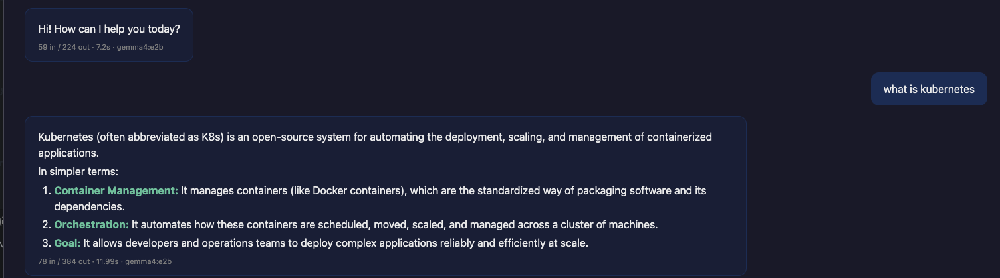
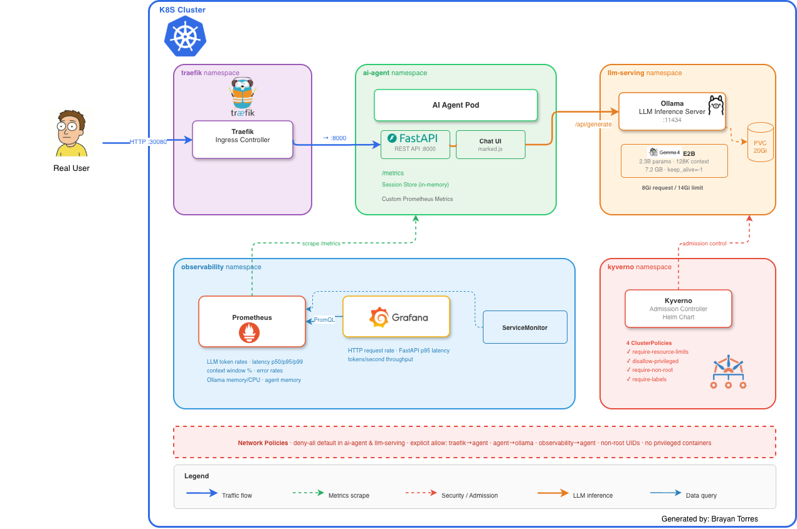
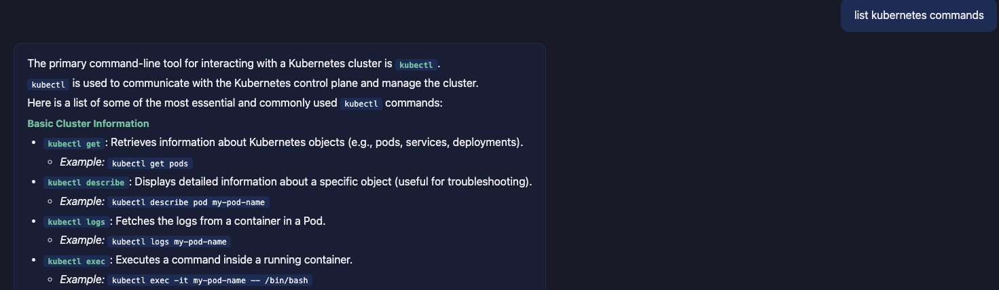
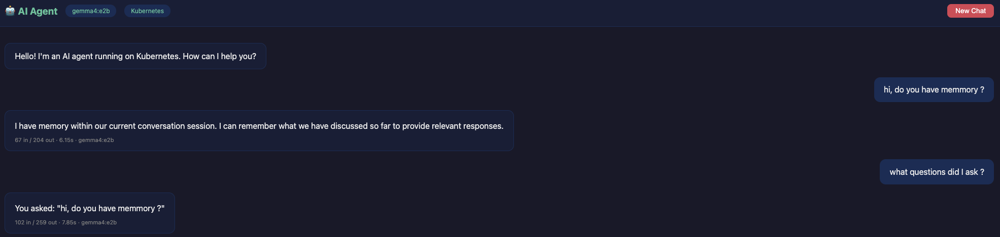
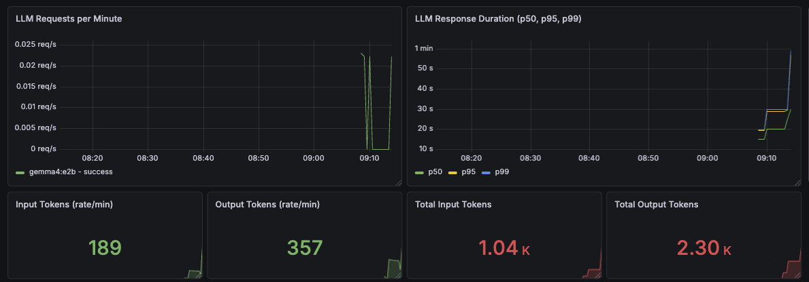
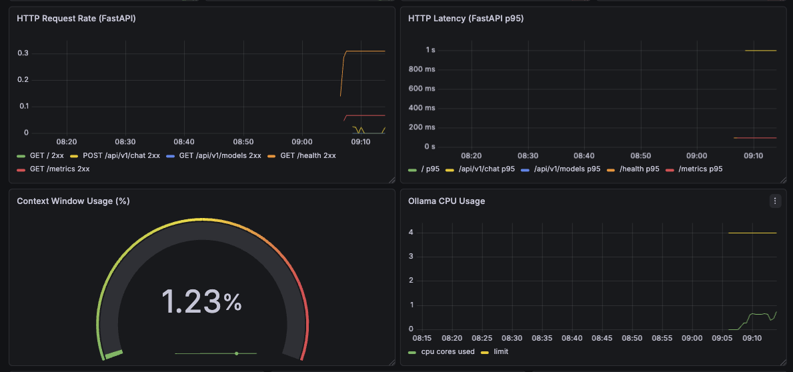
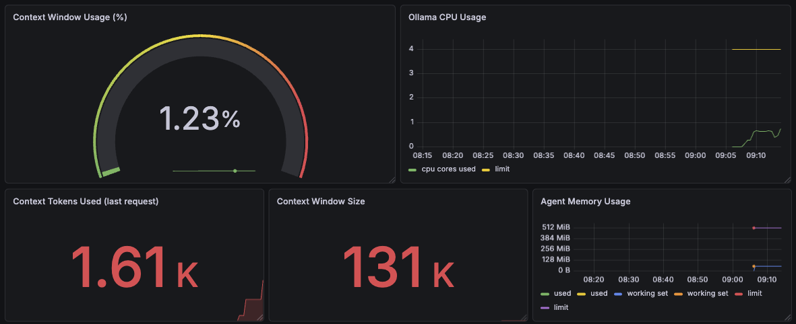

# End-to-End AI Agent on Kubernetes

A production-grade AI agent running entirely on a local Kubernetes cluster. Built with **Gemma 4 (2.3B)** on **Ollama**, a **FastAPI** backend with conversation memory, a dark-theme **chat UI** with markdown rendering, and full observability through **Prometheus + Grafana** — all secured with **Kyverno** policies and **NetworkPolicies**.



## Highlights

- **Local-first** — runs on a 3-node kind cluster with Docker Desktop, no cloud required
- **Conversation memory** — in-memory session store with sliding window (20 turns per session)
- **Markdown rendering** — LLM responses render with bold, lists, code blocks, and headings
- **Custom Prometheus metrics** — token counts, latency percentiles, context window usage, error rates
- **Grafana dashboard** — 18 panels auto-provisioned via sidecar
- **Defense-in-depth security** — Kyverno admission policies, deny-all NetworkPolicies, non-root containers

## Architecture



## Components

| Layer | Tool | Purpose |
|-------|------|---------|
| **LLM** | Ollama + Gemma 4 E2B | 2.3B effective params, 128K context window |
| **Backend** | FastAPI + httpx | Chat API, session management, Prometheus metrics |
| **Frontend** | HTML/JS + marked.js | Dark-theme chat UI with markdown rendering |
| **Ingress** | Traefik | NodePort ingress via Helm |
| **Security** | Kyverno | 4 ClusterPolicies: resource limits, no privileged, non-root, required labels |
| **Network** | NetworkPolicies | Deny-all default, explicit allow per namespace |
| **Metrics** | Prometheus | ServiceMonitor scraping custom LLM metrics |
| **Dashboards** | Grafana | Auto-provisioned dashboard with 18 panels |

## Screenshots

### Chat UI — Markdown Rendering & Conversation Memory

| Response rendering | Conversation memory |
|---|---|
|  |  |

### Grafana Dashboard — LLM Observability

| Request rates & latency | Context window & CPU |
|---|---|
|  |  |

| Context tokens & memory usage |
|---|
|  |

## Prerequisites

- **Docker Desktop** with at least **18 GB RAM** allocated
- [kind](https://kind.sigs.k8s.io) (`brew install kind`)
- [kubectl](https://kubernetes.io/docs/tasks/tools/)
- [Helm 3](https://helm.sh/docs/intro/install/) (`brew install helm`)

## Quick Start

```bash
# 1. Create the 3-node kind cluster + metrics-server + /etc/hosts entry
./scripts/setup-kind.sh

# 2. Deploy everything (infra → security → observability → ingress → agent)
make all

# 3. Test the agent
./scripts/test-agent.sh

# 4. Open the chat UI
open http://ai-agent.local:30080
```

### Access Services

```bash
# Chat UI (via Traefik ingress)
open http://ai-agent.local:30080

# Grafana dashboards (admin / admin)
make port-forward-grafana
open http://localhost:3000

# Agent API directly
make port-forward-agent
curl http://localhost:8000/api/v1/chat \
  -H "Content-Type: application/json" \
  -d '{"message": "What is Kubernetes?"}'
```

### Step-by-Step Deployment

If you prefer deploying components individually:

```bash
make deploy-infra          # Ollama + pull Gemma 4 E2B model
make deploy-security       # Kyverno + NetworkPolicies
make deploy-observability  # Prometheus + Grafana + dashboard
make deploy-ingress        # Traefik + ingress rules
make deploy-agent          # Build image + deploy to kind
```

## Project Structure

```
.
├── Makefile                        # Orchestrates all deployments
├── agent/
│   ├── Dockerfile                  # Multi-stage build, non-root user
│   ├── requirements.txt
│   └── src/
│       ├── main.py                 # FastAPI app + static file serving
│       ├── agent.py                # LLM client, session store, prompt builder
│       ├── routes.py               # /api/v1/chat, /api/v1/models
│       ├── metrics.py              # Custom Prometheus metrics
│       └── static/index.html       # Chat UI
├── k8s/
│   ├── kind/                       # Cluster config (3 nodes, port mappings)
│   ├── namespaces/                 # ai-agent, llm-serving, observability
│   ├── ollama/                     # Deployment, PVC, Service, ConfigMap
│   ├── agent/                      # Deployment, Service, ServiceAccount
│   ├── ingress/                    # Traefik IngressRoute
│   ├── security/
│   │   ├── kyverno-policies.yaml   # 4 ClusterPolicies
│   │   └── network-policies.yaml   # Deny-all + explicit allows
│   └── observability/
│       ├── grafana-dashboard-configmap.yaml  # 18-panel dashboard
│       └── service-monitor.yaml    # Prometheus ServiceMonitor
├── helm-values/
│   ├── prometheus-stack.yaml       # Prometheus + Grafana config
│   ├── traefik.yaml                # Traefik ingress config
│   └── kyverno.yaml                # Kyverno admission controller config
├── scripts/
│   ├── setup-kind.sh               # Cluster creation + prerequisites
│   └── test-agent.sh               # Health + chat integration test
└── docs/                           # Screenshots
```

## Observability

The Grafana dashboard (`AI Agent - LLM Metrics`) includes:

| Panel | Metric |
|-------|--------|
| LLM Requests/min | `rate(llm_requests_total[1m])` |
| Response Duration (p50/p95/p99) | `histogram_quantile` on `llm_request_duration_seconds` |
| Token rates & totals | `llm_tokens_input_total`, `llm_tokens_output_total` |
| Context Window Usage (%) | `llm_context_usage_ratio` — gauge showing 128K utilization |
| Context Tokens Used | `llm_context_tokens_used` — absolute count per request |
| Error Rate | `llm_errors_total` |
| HTTP Request Rate | FastAPI `http_requests_total` |
| HTTP Latency p95 | FastAPI `http_request_duration_seconds` |
| Ollama Memory & CPU | `container_memory_working_set_bytes`, `container_cpu_usage_seconds_total` |
| Agent Memory | Container memory usage vs limits |

## Security

**Kyverno Policies:**
- `require-resource-limits` — all pods must declare CPU/memory limits
- `disallow-privileged` — no privileged containers
- `require-non-root` — containers must run as non-root
- `require-labels` — pods must have `app` label

**Network Policies:**
- Default deny-all in `ai-agent` and `llm-serving` namespaces
- Explicit allow: Traefik → Agent, Agent → Ollama, Observability → Agent (metrics scraping)
- Ollama egress: DNS + HTTPS only

## Make Targets

```
make all                    # Deploy everything
make deploy-infra           # Ollama + model pull
make deploy-security        # Kyverno + network policies
make deploy-observability   # Prometheus + Grafana
make deploy-ingress         # Traefik
make deploy-agent           # Build + deploy agent
make clean                  # Tear down all resources
make create-cluster         # Create kind cluster
make delete-cluster         # Delete kind cluster
make port-forward-grafana   # Grafana at localhost:3000
make port-forward-agent     # Agent at localhost:8000
make port-forward-ollama    # Ollama at localhost:11434
make logs-agent             # Tail agent logs
make logs-ollama            # Tail Ollama logs
```

## Troubleshooting

| Issue | Fix |
|-------|-----|
| Ollama OOM | Increase Docker Desktop memory to 18 GB+ |
| Grafana OOM | Already configured at 512Mi limit; increase in `helm-values/prometheus-stack.yaml` if needed |
| Model pull timeout in kind | Kind nodes can't reach registries. Pull locally with `ollama pull gemma4:e2b`, then `kubectl cp ~/.ollama/models/ <pod>:/root/.ollama/models/` |
| Dashboard not loading | Check sidecar: `kubectl logs -n observability -l app.kubernetes.io/name=grafana -c grafana-sc-dashboard` |
| Stale metrics (duplicate values) | Old pod metrics age out; queries use `max by (model)` to deduplicate |

## License

MIT
